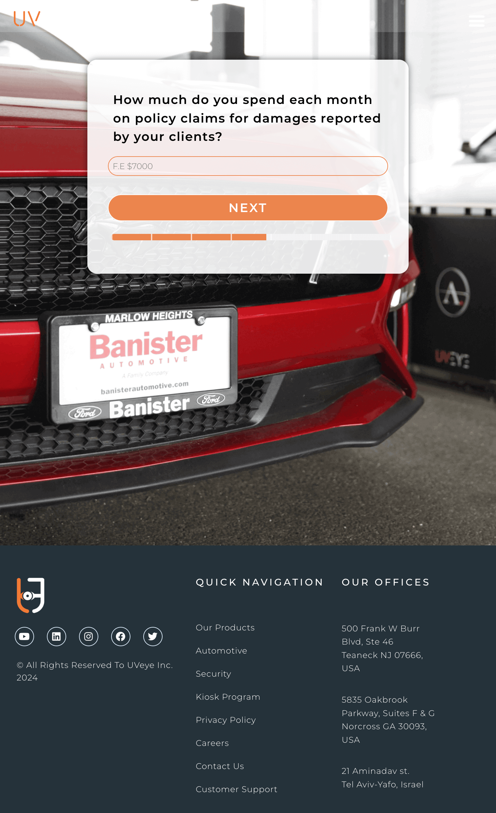

## UVeye ROI Calculator for Car Dealers
**© All rights reserved to UVeye INC.**

This is a **dummy version** of the **UVeye ROI Calculator** that estimates the potential Return on Investment (ROI) for Automotive dealerships using UVeye's automated vehicle inspection platform.
  
**⚠️ Important: This version of the UVeye ROI Calculator is intended for **demonstration purposes**. No real data is transmitted, and the API integration is disabled**.

---

**How It Works:**

- **1. Complete the multi-step form, providing responses to business-related questions.
 
- **2. Upon submission, an ROI estimation will be displayed based on the selected OEM and other inputs.

- **3. This version processes everything locally within the browser, without sending data to any external service.

---

**Technologies:**

- **JavaScript ES6**
- **CSS3**
- **HTML5**
